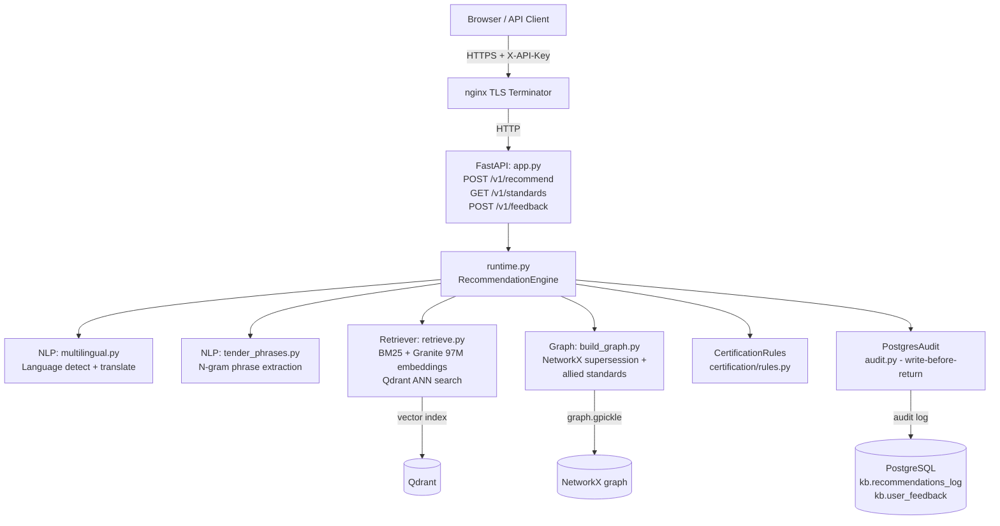
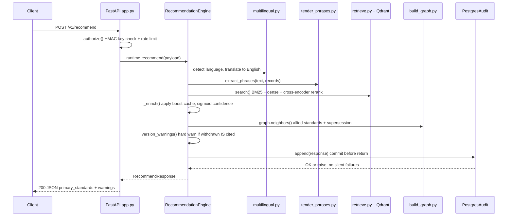

# StandX — Procurement Standards Recommendation Engine

Given a tender specification (text, PDF, or DOCX), returns the relevant Bureau of Indian Standards (BIS) IS numbers with confidence scores, version warnings, allied standards, and certification requirements — running entirely offline on a government server.

   

<!-- TODO: screenshot or 60s demo GIF here -->

---

## The Problem

Government procurement officers in India must cite the correct IS number for every item in a tender. The BIS catalogue contains 22,000+ active standards; choosing the wrong one — or an outdated revision — can invalidate a tender or expose a PSU to compliance risk. There is no automated lookup tool: officers currently search BIS portals manually, which is slow and error-prone at scale. The problem compounds in multilingual procurement where specifications arrive in Hindi or regional languages.

---

## What It Actually Does

- **Recommends IS numbers from tender text** — accepts raw text, PDF, or DOCX upload; extracts product phrases using n-gram matching against IS titles; retrieves candidates via hybrid BM25 + dense-embedding search (IBM Granite 97M); cross-encoder reranks; returns top-K results with confidence scores. (`services/recommendation/engine.py`, `services/nlp/tender_phrases.py`)
- **Resolves supersession chains** — the standards graph (`kb/build_graph.py`, NetworkX) walks multi-hop `superseded_by` edges to surface the final current revision, and raises a hard warning if a query directly cites a withdrawn standard.
- **Returns allied standards by type** — normative references, test methods, safety standards, and installation standards are surfaced per result with typed graph edges and evidence citations. (`GET /v1/standards/{is_number}/allied`)
- **Evaluates BIS certification requirements** — mandatory (ISI Mark, CRS), voluntary (Hallmark), or not-applicable rulings per product category, evaluated against caller-supplied context flags; every ruling cites an HTTPS `.gov.in` primary source. (`services/certification/rules.py`)
- **Handles Hindi and Hinglish input** — language detection via `langid`, transliteration and translation via a locally cached IndicTrans2 model; English loanword product terms are preserved through translation. (`services/nlp/multilingual.py`)
- **Logs every recommendation and feedback to PostgreSQL before returning** — no unaudited results; audit rows include KB fingerprint and model configuration snapshot. (`services/recommendation/audit.py`)

---

## Architecture



---

## Request Sequence — `POST /v1/recommend`



---

## Tech Stack

| Layer | Technology | Why |
|---|---|---|
| API | FastAPI 0.141 + Uvicorn | Async; Pydantic schemas enforce response contracts |
| Embeddings | sentence-transformers 6.1 + IBM Granite 97M | Multilingual retrieval; fully offline from local cache |
| Reranker | MiniLM cross-encoder (transformers 5.17) | Precise relevance scoring after candidate recall |
| Vector search | Qdrant 1.19 (local persistent) | ANN over embedding space; no cloud API |
| BM25 | rank-bm25 0.2 | Keyword recall for IS-number and title-exact queries |
| Standards graph | NetworkX 3.6 + Neo4j 5.26 (optional) | Supersession chains, allied standard traversal |
| Translation | IndicTrans2 (cached, offline) + langid | Hindi/Hinglish to English without external API calls |
| DB (audit) | PostgreSQL 17 / PGlite (dev) | Durable write-before-return audit log |
| Frontend | React 18 + TypeScript + Vite + Tailwind | Procurement workspace UI with feedback controls |
| Infra | Docker Compose + nginx | Fully offline on-prem stack; `internal: true` backend network |

---

## What Makes This Different

- **Every returned IS number is a KB record — enforced at the harness level.** `eval/metrics.py` flags any recommended IS number not in the index as a hard grounding failure. Hallucination rate measured at **0.0%** across 40 test queries. No generative model invents standards identifiers.
- **Negated procurement clauses are quarantined, not turned into purchase recommendations.** `tender_phrases.py` detects negation patterns (`no`, `not`, `excluding`) and routes them to a `manual_review_clauses` list rather than feeding them to the retriever.
- **Audit writes are transactional and pre-response.** `PostgresAudit.append()` commits inside a `with connection.transaction()` block before the HTTP response returns. There is no code path that returns a recommendation without a committed audit row.
- **Active-learning boost layer is additive and reversible.** `scripts/retrain_reranker.py` writes per-standard +/-0.1 score adjustments to `reranker_boosts.json`; `_BoostCache` in `engine.py` reloads on mtime change. No model weights are modified; deleting the file resets all boosts to zero.

---

## Quickstart

### Prerequisites

- Python 3.11, Node 20+
- Model files provisioned locally (one-time, offline after download)

```sh
# 1. Clone and install Python dependencies
git clone <repo-url>
cd SIH26108
pip install -r requirements.txt

# 2. Provision model weights (one-time download, then fully offline)
npm run models:provision
npm run translation:provision

# 3. Copy and fill environment config
cp .env.example .env
# Set DATABASE_URL, API_KEYS_JSON (officer_id:secret pairs, secrets >= 24 chars)

# 4. Build the knowledge base index and graph
npm run seed:build
python kb/build_index.py

# 5. Run the local dev stack (PGlite + local models + API)
npm run api:local       # API on http://127.0.0.1:8000

# 6. Run the React frontend
npm --prefix frontend ci --ignore-scripts
npm run phase9-demo     # frontend on http://127.0.0.1:5173
```

**Key env vars** (from `.env.example`):

| Variable | Purpose |
|---|---|
| `DATABASE_URL` | PostgreSQL DSN for audit logging |
| `API_KEYS_JSON` | `{"officer_id": "secret>=24chars"}` |
| `RETRIEVAL_CONFIG` | Path to `kb/retrieval_config.json` |
| `RECOMMENDATION_CONFIG` | Path to `services/recommendation/config.json` |
| `MULTILINGUAL_CONFIG` | Path to `services/nlp/multilingual_config.json` |

**Run tests:**

```sh
npm test              # 26 unit tests
npm run phase10-demo  # eval harness: Recall@5, MRR, hallucination rate
npm run load:test     # offline load test: p50/p95 at 20 concurrent users
```

**Production (on-prem server):**

```sh
# Requires: ./secrets/ directory with postgres_password.txt etc.
docker compose -f docker-compose.prod.yml up -d
```

<details>
<summary>Project Structure</summary>

```text
.
+-- services/
|   +-- api/            FastAPI app, routes, schemas, document extraction, auth
|   +-- recommendation/ Engine, audit writer, active-learning boost cache
|   +-- ingestion/      Record contract, seed loader, KB validator
|   +-- nlp/            Language detection, IndicTrans2 translation, phrase extractor
|   +-- certification/  BIS certification rules evaluator (ISI, CRS, Hallmark)
+-- kb/
|   +-- build_graph.py  NetworkX standards graph from seed records
|   +-- build_index.py  Qdrant + BM25 index builder
|   +-- local_models.py Model loading with offline enforcement
|   +-- graph.gpickle   Pre-built graph (150-record seed)
+-- eval/
|   +-- gold_set.json   40 synthetic tender queries with expected IS numbers
|   +-- metrics.py      Recall@K, MRR, hallucination rate (pure, offline)
|   +-- run_eval.py     Harness runner - exits 1 on any hallucinated IS number
|   +-- test_*.py       26 unit tests across all modules
+-- frontend/           React + TypeScript + Vite + Tailwind procurement workspace
+-- scripts/
|   +-- retrain_reranker.py   Active-learning boost update from feedback
|   +-- run_load_test.py      Offline load test (20 users, p50/p95)
|   +-- locust_load_test.py   HTTP load test via Locust
+-- data/
|   +-- processed/      standards_seed.json, certification_rules.json, eval reports
|   +-- raw/            BIS portal metadata snapshots with fetch provenance
+-- docs/               Architecture, eval plan, security/governance, pilot readiness
+-- infra/nginx/        nginx TLS reverse proxy config for production
+-- docker-compose.yml          Dev stack
+-- docker-compose.prod.yml     Production stack (resource limits, WAL, Docker Secrets)
+-- .env.example        All required environment variables with descriptions
```

</details>

---

## Challenges & What We Learned

- **Grounding without a generative model is harder than it sounds.** Ensuring every IS number in a response exists in the index required building an explicit hallucination check at the eval harness level and a hard audit-commit gate at the API level — not just trusting that retrieval would naturally stay in bounds.
- **The Python GIL is the real concurrency bottleneck.** Under 20 concurrent users, engine overhead (p95 = 65 ms) is fine, but embedding inference is GIL-bound. Production at scale requires multiple API replicas or moving the reranker to a separate subprocess.
- **Multilingual retrieval needs loanword-aware normalisation.** Naively translating "steam iron ki aapurti" (Hinglish) can strip "iron" before it reaches the IS title matcher. The solution — preserving identifiable English product tokens through transliteration — only became apparent from fixture retriever failures on Devanagari queries.

<!-- TODO: fill in from the team's actual SIH experience -->

---

## What's Next

- **Expert-validated gold set** — replace the 40 synthetic queries with BIS Sectional Committee-annotated items (IAA >= 0.70 target); current set is clearly labeled synthetic/demo only.
- **Licensed BIS data feed** — formal data-sharing agreement to expand from 150-record seed to the full 22,000+ IS catalogue; ETL pipeline design is in `docs/security_and_governance.md`.
- **CERT-In VAPT and SSO** — RBAC upgrade from static API keys to NIC NeSL LDAP/Keycloak; security audit before any real tender data is processed.
- **GPU inference path** — ONNX Runtime export of the cross-encoder to cut reranker latency from ~600 ms to ~80 ms per query without changing the retrieval architecture.
- **GeM / CPPP portal widget** — embedded iframe or server-side REST integration; design in `docs/portal_integration_plan.md`; requires formal GeM API partnership.

---

## Team

<!-- TODO: add team members -->

| Name | Role | Link |
|---|---|---|
| — | — | — |

---

## License

<!-- TODO: confirm LICENSE file exists in repo root; if not, add one or remove this section -->

This project is released under the MIT License.
