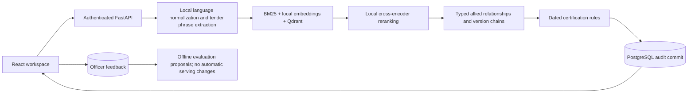

# StandX — Procurement Standards Assistant

StandX helps procurement officers turn product requirements into an evidence-backed shortlist of Indian Standards. Paste a specification or upload a text-based PDF or DOCX, inspect related standards and version warnings, and export the exact metadata used in the recommendation. English, Hindi and Hinglish inputs use locally cached models; no external inference API is called.

This is an independent prototype, not a BIS service or a compliance authority. The knowledge base contains **20 individually verified public metadata observations and 130 explicitly labelled synthetic editions**. Verified observations preserve their fetch dates; they do not establish that an edition is currently the latest. Certification mappings retain official citations, verification dates, scope conditions and unknown applicability. Officers must review those details before relying on a recommendation.

## Run the clickable demo

With dependencies, model caches and the local index already provisioned:

```sh
npm run phase9-demo
```

Open **http://127.0.0.1:5173**. This command starts the local database, API and frontend together. Stop another instance before launching tests: the embedded vector store permits one owning process. The demo enables synthetic fixtures explicitly; the default recommendation configuration excludes them.

The six workspace views are functional: specification input, recommendations, officer-scoped audit history, searchable KB directory, evidence export and read-only runtime settings. Drafts stay in the current tab when navigating. API secrets are never written to browser storage. The demo proxy's temporary key remains server-side.

For first-time provisioning, use the pinned dependencies in `requirements.txt`, root `package-lock.json` and `frontend/package-lock.json`; run `npm ci --ignore-scripts` and `npm --prefix frontend ci --ignore-scripts`. Model acquisition is an explicit online step through `npm run models:provision` and `npm run translation:provision`, subject to the model licenses documented in `docs/SOURCES.md`. Build the local index with `python kb/build_index.py`. Runtime verifies cached assets and fails if they are missing; it never downloads replacements. Backend target is Python 3.11; the recorded Windows validation environment uses Python 3.14.6 and Node 24.19.0. Check the lockfiles' engine constraints when choosing a new environment.

## How a recommendation is assembled



Every returned primary/allied standard has a record citation. Low scores produce an explicit human-review response. Relevance scores are **uncalibrated**, not probabilities of correctness. Exact IS-number matches establish identity only. Supersession follows the entire evidenced chain; unverified currentness and amendment resolution remain unknown.

The local graph defaults to NetworkX; an optional Neo4j projection exists. PostgreSQL stores recommendation snapshots and feedback; the laptop runner uses PGlite's PostgreSQL-compatible database. Qdrant and models run locally. Only public standard metadata is indexed, not copyrighted full-text standards.

## Quality checks — Phase 12

```sh
npm run phase12-demo    # unit tests, formatting, frontend build, API integration, browser flows
npm run eval:real       # actual cached retrieval + local normalization on 40 synthetic evaluation queries
npm run phase9-demo     # interactive demonstration
```

The checks fail on errors. API integration covers officer isolation, source evidence, uploads, Unicode validation, body limits, rate limits and OpenAPI. Browser tests exercise real cached models and local SQL, including Hindi/Hinglish, feedback, persisted history, downloads, mobile layout, reduced motion and failure states. Browser external requests are blocked during testing.

Phase 12 fixes the previous placeholder upload path, synthetic records mislabelled as “BIS LIVE”, fabricated history/compliance claims, nonfunctional settings and blocked Swagger scripts. It also removes automatic feedback boosts, adds bounded inference admission, and corrects evaluation metrics. See [the quality review](docs/quality_review.md) for measured results and remaining limits.

The fixture-only Phase 10 and Phase 11 runners test harness/engine behaviour. **Their accuracy and latency figures are not real-model or concurrent HTTP performance claims.** The real evaluation reports candidate recall separately from out-of-scope abstention and execution errors. Its author-written labels still require expert validation.

## API

All `/v1` endpoints require `X-API-Key`. Keys map to officer IDs via `API_KEYS_JSON`. API docs at `/docs` use bundled local assets.

| Endpoint | Purpose |
|---|---|
| `POST /v1/recommend` | JSON text or multipart PDF/DOCX, maximum 5 MiB file |
| `GET /v1/standards` | Search and paginate allowed metadata records |
| `GET /v1/standards/{is_number}` | Record, citations, version status and rules |
| `GET /v1/standards/{is_number}/allied` | Typed allied relationships |
| `GET /v1/certifications/{product_category}` | Dated rules and scope conditions |
| `GET /v1/history` | Current officer's saved requests |
| `GET /v1/history/{recommendation_id}` | Restore an owned evidence snapshot |
| `POST /v1/feedback` | Feedback on an owned recommendation |
| `GET /v1/system` | Safe active configuration and corpus counts |
| `GET /v1/health` | Dependency status |

Legacy audit rows without a recorded owner are not assigned to an officer automatically. History and feedback reject cross-officer access. Recommendation admission defaults to four in-flight requests per API process (`API_MAX_INFLIGHT`); excess requests receive 503 with `Retry-After`. Runtime serializes model/database work. This protects the local worker; it is not a throughput guarantee.

## Project guide

| Location | Contents |
|---|---|
| `data/raw`, `data/processed`, `data/mock` | Captured public metadata, processed KB and labelled fixtures |
| `kb` | PostgreSQL schema, graph and vector-index builders |
| `services/ingestion` | Idempotent metadata ingestion and validation |
| `services/nlp` | Retrieval, normalization and tender phrase extraction |
| `services/recommendation`, `services/certification` | Evidence assembly, audit and dated rule evaluation |
| `services/api`, `frontend` | API and procurement workspace |
| `eval` | Unit tests, synthetic query labels and evaluation metrics |
| `docs` | Architecture, acquisition, integration, governance and source audit |

Phase demos remain available as `npm run phase0-demo` through `phase12-demo`. Phases 0–1 cover scaffold/architecture, 2 metadata, 3 graph, 4 retrieval, 5 recommendation, 6 certification, 7 languages, 8 API, 9 frontend, 10 evaluation, 11 fixture load tests and 12 quality regression checks. Results from earlier phases are historical observations; use current check output for the working tree.

## Evidence and limits

- [Architecture](docs/architecture.md), [data acquisition](docs/data_acquisition_plan.md), [multilingual design](docs/multilingual_design.md), [portal integration](docs/portal_integration_plan.md).
- [Source audit](docs/SOURCES.md) records official lookups and dependency verification. [Project context](PROJECT_CONTEXT.md) records phase history.
- Complete BIS coverage, expert-approved relevance labels, exhaustive certification applicability and production operational assurance remain future work. Actual GeM integration requires a formal arrangement; none is claimed here.
- Deployment was explicitly excluded from this quality pass. Existing deployment files were not validated or changed.
- No project-wide LICENSE file is present. Distribution licensing requires the owner's decision; third-party code, models and BIS content retain their own terms.

## Phase 13 — separate Vercel frontend

The Vercel deployment uses `frontend` as its root and a separate StandX project;
the existing `latent` deployment is preserved. Run `npm run phase13-demo` to check
the gateway and production frontend build. See [deployment configuration](docs/vercel_deployment.md).

The owner confirmed no hosted backend is available yet. The hosted frontend
therefore shows an explicit unavailable notice; online recommendations and audit
history need the separately hosted FastAPI/data/model stack. No mock backend is
substituted. Once hosted, configure the server-only `STANDX_API_ORIGIN` and use
individual officer API keys.
