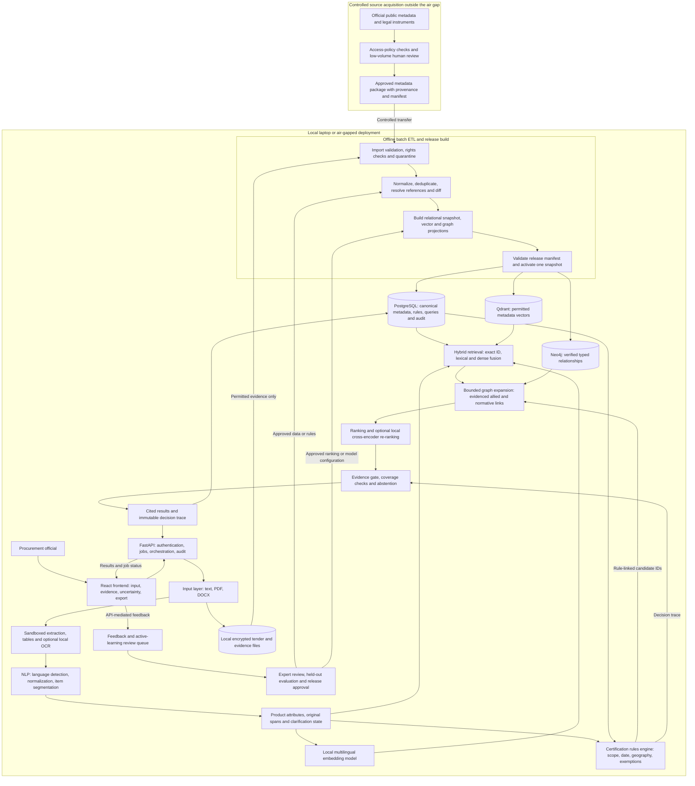
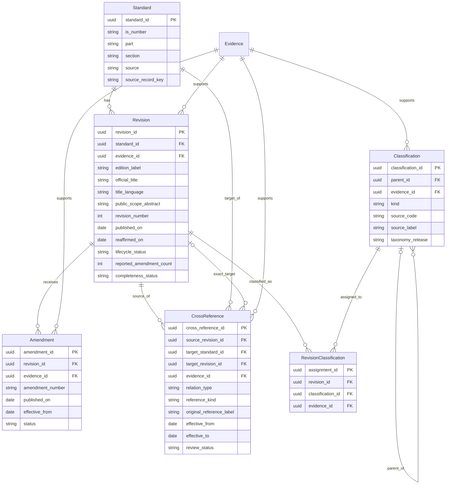
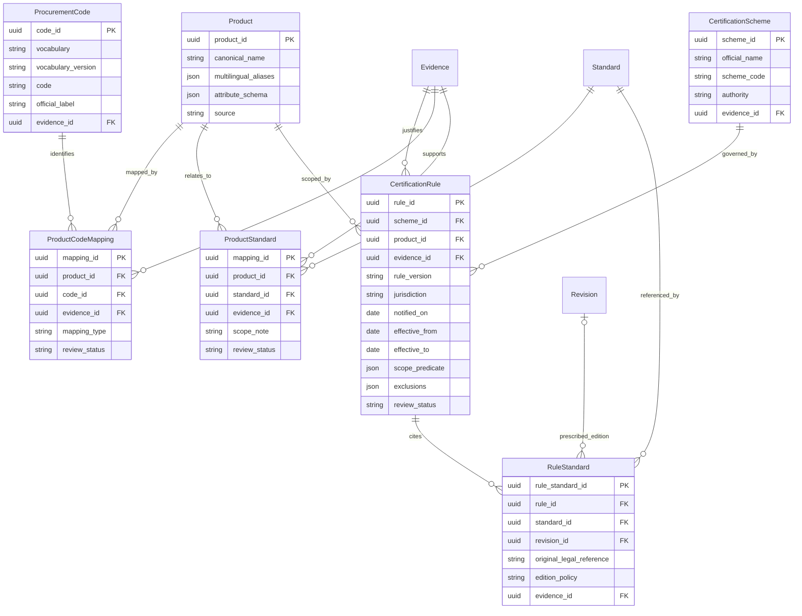
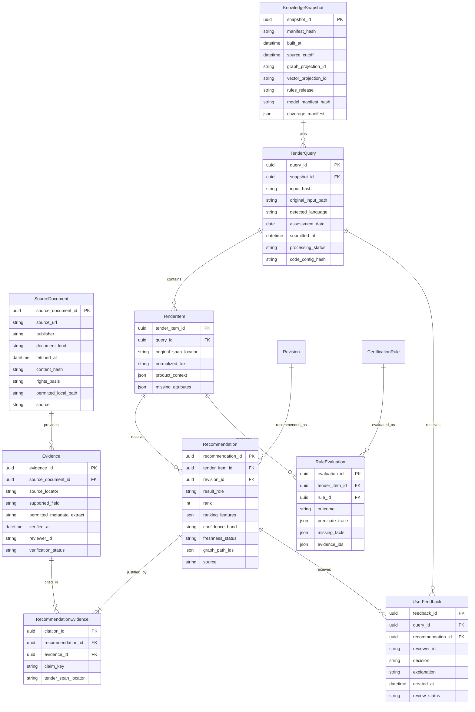

# Procurement Standards Recommendation Engine — Solution Architecture

**Phase 1 · Research date: 20 September 2026 · Status: proposed architecture**

This document specifies the intended system. The repository currently contains the Phase 0 scaffold and synthetic provenance demonstration; the components, performance targets, and judged demonstration below are not implemented yet. Research preceded drafting for approximately ten minutes. Source URLs, fetch dates, uses, and access failures are recorded in [SOURCES.md](SOURCES.md).

## 1. Problem statement and user stories

A procurement official has a tender specification expressed in product descriptions, performance requirements, installation conditions, and sometimes outdated standards references. The official needs an evidence-backed shortlist of applicable Indian Standards, relevant editions and amendments, and related normative, test-method, terminology, safety, and installation standards. The official also needs a separate assessment of potentially applicable certification obligations, grounded in the relevant legal instruments and the actual product context.

The system must explain how each tender requirement led to each recommendation. It must preserve uncertainty about product interpretation, source completeness, legal applicability, and metadata freshness. It must work on a local laptop without network access after provisioning and must allow an auditor to reconstruct a result from the exact knowledge-base snapshot used.

The system supports procurement review; it does not issue certification, establish a manufacturer's licence validity, or automatically approve tender clauses. Public metadata is the default evidence boundary. Licensed full text may be considered only when explicitly supplied by the user under an appropriate licence. An unavailable scope or reference is a coverage gap, not permission to infer a standard's contents.

### Procurement-official user stories

| ID | User story | Concrete acceptance evidence |
| --- | --- | --- |
| US-01 | As a procurement officer drafting a tender for LED street lights, I want relevant IS identifiers, editions, amendments, related tests and safety standards, and an explanation of which certification route may apply, so that I can draft supported requirements. | Each result cites a KB record; the screen distinguishes ISI, CRS, other applicable routes, and unknown applicability. It does not assume that an LED product necessarily uses the ISI route. |
| US-02 | As an officer receiving a Hindi, Bengali, Tamil, or Marathi specification, I want the same product intent understood across languages while retaining the original wording, so that translation does not change my technical requirement. | Original and normalized passages appear together; quantities, units, negation, and existing IS references remain traceable; uncertain translations request clarification. |
| US-03 | As an officer reusing an older tender, I want cited editions checked against the snapshot's revision, amendment, reaffirmation, and supersession information, so that I can review obsolete references. | The cited edition and latest known edition are shown separately with dates and evidence; a law-prescribed older edition is not silently replaced. |
| US-04 | As an officer procuring equipment with installation work, I want separate primary-product, test-method, allied-safety, and installation recommendations, so that the tender covers the relevant work. | Related results expose typed, directed, evidenced graph paths and applicable scope; absence of verified relations appears as incomplete coverage. |
| US-05 | As an officer buying laptops or other electronics, I want to know which product attributes and legal notifications determine registration requirements, so that a keyword match cannot be mistaken for mandatory certification. | The assessment shows product assumptions, scheme, effective date, rule evidence, exemptions, and any missing facts; manufacturer registration verification is a separate official-portal action. |
| US-06 | As an officer procuring jewellery, I want an applicability check that asks for relevant material, product, transaction, location, and date details, so that a general hallmarking label does not conceal exemptions or geographic scope. | The rule trace identifies the facts actually required by reviewed rules and returns unknown if required context or legal evidence is absent. |
| US-07 | As an officer preparing a government audit file, I want an offline evidence export, so that another reviewer can reproduce my shortlist and inspect why each standard was included. | Export contains tender hash and cited passages, IS/record/revision IDs, source URLs and timestamps, graph/rule traces, snapshot/model versions, warnings, and reviewer decisions. |
| US-08 | As an officer facing an ambiguous specification, I want the system to ask a useful clarification or abstain, and to accept my correction, so that uncertainty becomes visible and later improvements are reviewed. | Low-confidence results are labeled; no unsupported identifier is emitted; feedback enters a review queue and cannot immediately alter production rules or standards data. |

These are intended workflows, not assertions that any example product is subject to a particular requirement today.

## 2. Research findings and architectural consequences

### 2.1 Comparable systems and published work

Public product documentation establishes visible capabilities, not undocumented backend internals. The architectural consequences below are our design choices.

| Precedent | What the source supports | Consequence for this project |
| --- | --- | --- |
| ISO Online Browsing Platform | ISO documents OBP access and search, while separating browsing from purchasing/access restrictions. The advanced-search page could not be opened because of robots restrictions. [ISO documentation](https://helpdesk-docs.iso.org/article/596-online-browsing-platform-obp) | Provide exact-identifier and metadata discovery, preserve catalogue navigation, and keep licensed content access separate from recommendation evidence. Do not infer access rights from discoverability. |
| ANSI Webstore / Standards Connect | Official materials describe standards search, subscription access, administrative roles, and updates. The 2020 announcement is historical; the current indexed Webstore still describes subscription updates. [ANSI announcement](https://www.ansi.org/standards-news/all-news/21-ansi-launches-new-improved-standards-connect), [Webstore](https://webstore.ansi.org/) | Treat identifiers, document status, permissions, and change awareness as first-class data. Similarity search complements structured lookup. No proprietary search internals are assumed. |
| EU CE workflow and Access2Markets | Official guidance separates applicable legislation/standards, product-specific requirements, conformity assessment, and documentation. Access2Markets uses product/customs-code discovery and contextual requirements. [CE workflow](https://single-market-economy.ec.europa.eu/single-market/goods/ce-marking/manufacturers_en), [Your Europe](https://europa.eu/youreurope/business/product-rules-compliance/general-product-compliance/identifying-product-requirements/index_en.htm) | Separate relevance retrieval from applicability rules. Ask for missing context and show a decision trail. These are workflow precedents; EU legal rules are not imported as Indian requirements. |
| Industry 4.0 standards knowledge graph, I40KG | The research represents standards, classification frameworks, and relations through an ontology and graph. [Primary paper](https://arxiv.org/abs/2107.01910) | Model explicit, provenance-backed relationships rather than one undifferentiated similarity score. Do not turn inferred relationships into official normative references. |
| ETSI standards retrieval study | The study evaluates structured indexing, lexical/dense fusion, and graph methods on synthetic questions. Its results report benefits from structure/fusion but no consistent benefit from neighbor expansion and graph re-ranking. [Method and results](https://arxiv.org/html/2604.09868v1) | Preserve structure, use hybrid retrieval, and bound graph expansion. Evaluate graph contributions separately. Results obtained with standards full text do not establish accuracy for our metadata-only corpus. |
| Regulatory information retrieval and answer generation | RIRAG emphasizes obligation coverage and contradictions. A RegNLP follow-up demonstrates that an automated score can be inflated without good answers. [RIRAG](https://arxiv.org/abs/2409.05677), [evaluation critique](https://aclanthology.org/2025.regnlp-1.8/) | Measure retrieval, evidence validity, rule decisions, and abstention independently with reviewed cases. Do not use an LLM-generated score as the sole quality gate. |
| Structured compliance checking | A published framework distinguishes factual knowledge, regulatory/process information, and retrieval/reasoning. [COLING paper](https://aclanthology.org/2025.coling-main.178/) | Keep standards metadata, versioned legal rules, and query-time calculations separate, with reproducible joins between them. |

### 2.2 BIS digital services observed during research

| Surface | Evidence available on the research date | Integration boundary |
| --- | --- | --- |
| Know Your Standard | BIS describes IS-number/keyword search and links to amendments, gazette notifications, testing/inspection information, licences, laboratories, and classification. Its Explore link points to `standards.bis.gov.in`. [BIS description](https://www.bis.gov.in/know-your-standard/?lang=en) | Enrich a procurement workflow around existing discovery. Preserve official source links. Discovery of a document does not authorize downloading it. |
| `standards.bis.gov.in` | The indexed landing page shows Know Your Standards and published, new, revised, and review links. Direct robots-policy retrieval timed out. [Official landing page](https://standards.bis.gov.in/) | Treat it as an observed current entry point; connector behavior, stable IDs, API availability, and full taxonomy export remain unverified. |
| `services.bis.gov.in` | One public metadata page exposed revision/amendment counts; Group, Sub Group, Sub Sub Group, and Aspects; and incoming/outgoing cross-references. An indexed catalogue also has a separate Reaffirmation Year field. [Metadata page](https://www.services.bis.gov.in/php/BIS_2.0/bisconnect/standard_review/Standard_review/Isdetails?ID=Nzc3NQ%3D%3D), [catalogue example](https://services.bis.gov.in/php/BIS_2.0/dgdashboard/published/standards?aspect=&commttid=MzMw&commttname=TElURCAyMg%3D%3D&from=&to=) | Mirror these field concepts and preserve opaque source identifiers. This was schema reconnaissance, not validation of the example standard's latest status or ingestion of a real record. |
| Manak Online | The public login page exposes authentication/CAPTCHA/OTP and directs jeweller registration to NSWS. An indexed official manual describes licensing workflows. [Login landing page](https://www.manakonline.in/MANAK/eBISLogin), [manual description](https://manakonline.in/MANAK/resources/app_srv/Manuals/applicant_new.pdf) | Link out for official transactions. No automated login, CAPTCHA handling, applications, or licence changes. The bare host failed certificate validation and was not bypassed. |
| Certification and CRS | BIS's compulsory-certification index explains the QCO mechanism and lists Schemes I, II, IV, and X. The CRS overview identifies Scheme II. [BIS index](https://www.bis.gov.in/product-certification/products-under-compulsory-certification/?lang=en), [CRS overview](https://www.crsbis.in/BIS/whatisCRS.do) | Use an extensible scheme catalogue. Product applicability requires reviewed operative instruments, dates, and exceptions; a catalogue flag alone is insufficient. |
| Hallmarking | The official index lists the order, amendments, exemptions guidance, and district coverage. [BIS hallmarking index](https://www.bis.gov.in/hallmarking-overview/mandatory-hallmarking-order/?lang=en) | Support geographic and temporal scope. An index entry is a discovery lead, not a fully evaluated legal rule. |
| BIS Care | BIS describes standards information, licence verification, HUID verification, and CRS R-number verification. [BIS Care](https://www.bis.gov.in/bis-apps/?lang=en) | The recommendation service must distinguish applicability advice from verification of an actual supplier, product, or registration. |

**Acquisition decision:** no supported public bulk metadata API was verified in this research. This does not establish that none exists. Begin with a small, manually reviewed public-metadata subset or an authorized BIS-supplied export. Do not enumerate opaque URLs or build a scraper to obtain the assumed full corpus. An authorized source arrangement is a prerequisite for comprehensive coverage.

BIS's website terms caution that website information is not a statement of law. Its website copyright policy is not treated here as a standards full-text licence. The separate standards copyright-policy link timed out. **Unverified access permissions, portal behavior, and API contracts are unverified — confirm before relying on this.** The stricter project restriction remains: public metadata only, no BIS standard PDF downloads. [BIS terms](https://www.bis.gov.in/terms-and-conditions/?lang=en), [website copyright policy](https://www.bis.gov.in/copyright-policy/?lang=en)

## 3. Component architecture

### 3.1 System boundaries and data flow

All components inside the local boundary run without internet access. The source-acquisition workstation is a separate, optional connected environment. The batch ETL itself can execute entirely offline on an approved import package.

The diagram shows logical responsibilities, not a requirement for one service per box. Start with the existing `services/api`, `services/ingestion`, and `services/nlp` boundaries, a background job worker, and the three user-selected data stores. PostgreSQL is authoritative; Qdrant and Neo4j are rebuildable projections. `kb` owns projection builds, `frontend` owns the interface, and `eval` owns reviewed evaluation cases and release gates.

### 3.2 Query-time processing

1. **Accept and isolate input.** Validate file signature/type, size and page limits. Extract user-provided tender text and tables in a restricted worker; invoke local OCR only when needed. Reject encrypted or unreadable files with a useful reason. Do not execute DOCX macros, PDF actions, embedded links, or instructions contained in documents. Preserve file hash, page/paragraph/table-cell anchors, and extraction confidence.
2. **Normalize without erasing evidence.** Keep original Unicode text and span offsets. Detect language per segment; normalize punctuation and numerals in a derived view, preserve units and negation, and identify product lots separately. Use reviewed bilingual terminology plus a locally provisioned multilingual model. An English translation may supplement retrieval but must not replace the original text or become an official standards title. Low-confidence OCR or translation triggers correction/clarification.
3. **Retrieve candidates per product item.** Resolve explicit identifiers including parts/sections/years through structured lookup first. Combine weighted PostgreSQL lexical retrieval and Qdrant dense retrieval through application-side reciprocal-rank fusion. PostgreSQL documents weighted text-search ranking; its baseline here is not described as BM25. Qdrant documents hybrid/multi-stage fusion; a future all-Qdrant hybrid variant is an evaluation option. [PostgreSQL](https://www.postgresql.org/docs/current/textsearch-controls.html), [Qdrant](https://qdrant.tech/documentation/search/hybrid-queries/)
4. **Check rules independently of semantic top-k.** Use extracted product context to select reviewed rules by category, scope, jurisdiction, and assessment date. Add standard IDs required by potentially applicable rules to the candidate set even if semantic retrieval missed them. If an instrument cites a standard absent from the KB, show a coverage gap and abstain from recommending that missing record.
5. **Expand evidenced relationships.** Follow allowed typed graph edges, with source-revision and effective-date constraints. Start with a proposed two-hop ceiling and explicit node/time budgets. Preserve direction, visited-set cycle protection, and paths. Label missing references or budget truncation; never claim completeness after truncation. Similarity alone cannot create a normative edge.
6. **Rank and package.** Re-rank the bounded shortlist using tender scope, identifier match, metadata relevance, status, evidence quality, and optionally a local cross-encoder. Model selection awaits live model-card, licensing, memory, and language checks. A retrieve/re-rank separation is supported by the [Sentence Transformers documentation](https://sbert.net/examples/sentence_transformer/applications/retrieve_rerank/README.html). Keep required and related items in explicit categories so re-ranking cannot silently remove a rule-linked requirement.
7. **Gate every claim.** Hydrate all identifiers/titles from the pinned PostgreSQL snapshot. Emit recommendations only with a specific IS identifier, record/revision ID, supporting metadata evidence, and tender passage. Graph claims additionally need edge evidence; certification claims need rule/legal evidence. Optional generated explanations may summarize this structured packet but cannot introduce facts. A deterministic explanation template is sufficient for the initial demo.
8. **Persist and return.** Save the input context, candidate scores, evidence references, rules evaluated, warnings, model/configuration hashes, and exact result before returning it. Return matching confidence, source freshness, and rule-coverage status separately. A similarity score is not a probability of applicability. If sufficient evidence is absent, return an abstention with missing facts; an abstention is not an uncited standards recommendation.

### 3.3 Certification decision contract

Each assessment is scoped to one product item, one scheme, a declared assessment date, and the context required by its reviewed rules. A standard's general certification flag is only a retrieval aid. The rules are versioned declarative predicates interpreted by controlled code, not model-generated executable code.

| Outcome | Required basis |
| --- | --- |
| `mandatory` | Reviewed operative instrument, satisfied scope predicates, resolved effective date, and no applicable exclusion under the evaluated rules. |
| `not_mandatory_under_reviewed_rules` | Positive evidence of an exclusion or reviewed coverage sufficient for this specific scheme/context. This is never inferred from an empty search result or a blank BIS flag. |
| `conditional` | A potentially applicable rule exists, but named product/context facts must be supplied. |
| `unknown` | Missing legal evidence, incomplete rule coverage, stale evidence, or unavailable source facts. |
| `conflicting` | Applicable sources/rules disagree and reviewed precedence does not resolve the disagreement. Human review is required. |

Store notification date, commencement/effective date, transitional dates, amendments/revocation, geography, applicable actor/transaction, and exceptions separately. Exact predicate fields vary with the instrument; do not assume every rule needs every field. Keep the edition legally referenced separate from the latest catalogue edition. A newer standard does not automatically rewrite a legal instrument's reference. Drafts and future rules cannot be presented as currently operative.

### 3.4 Batch ETL, freshness and learning

Acquire public metadata through approved low-volume review or an authorized export. Source access needs host-specific robots/terms/licence review before any connector is enabled. Failure, CAPTCHA, rate limits, or uncertain reuse rights stop acquisition; runtime recommendations never trigger portal scraping. Standards full-text URLs are not acquisition jobs.

An offline import package contains provenance, permitted metadata extracts, field coverage, source dates, checksums, and review decisions. ETL validates `source`, separates synthetic and real records, preserves unknowns, resolves identities, and quarantines contradictions or unresolved links. It never converts a generic reference into a typed normative relation without evidence. Missing rows in a partial import are not withdrawals.

Build new PostgreSQL snapshot rows and matching versioned vector/graph projections without modifying the active release. A release manifest names all three projections plus rules, taxonomy, language resources, models, and code/configuration hashes. Verify counts, referential integrity, rights, source labels, and retrieval/rule regressions. Activate a single application release pointer only after every projection is ready; each query pins that release. Rollback reactivates a previous complete release. No distributed transaction or simultaneous alias update across three databases is assumed.

Use a proposed weekly review of available updates, with expedited review when an operative notification is identified. This is an internal target, not a promise about BIS publication cadence or air-gap transfer frequency. Display source-level `verified_at`, import time, coverage, and snapshot age. Offline results say **latest known in snapshot**, never unqualified **latest today**. A configurable freshness policy downgrades or withholds definitive applicability conclusions.

Feedback is stored separately from authoritative metadata. Active learning prioritizes uncertain matches, disagreement, language failures, and missing relationships for expert labeling. Reviewed examples can improve terminology, ranking, and calibration through offline batches and held-out evaluation. Feedback cannot directly amend legal rules, generate official cross-references, or train on confidential tenders without an approved data-use basis.

## 4. Logical data model

The following three ER views describe one model. Repeated entity names denote the same entity. They are split for readability, and show principal fields rather than complete migrations. `PK` and `FK` denote keys; nullable references and additional constraints are explained below.

### 4.1 Standards, editions, taxonomy and relationships

**Identity and lifecycle.** A `Standard` represents a stable IS identity, including part/section where applicable; `Revision` represents an edition with its own title and metadata. Preserve original identifiers and raw metadata alongside reviewed normalization. Years must not be stripped from dated references. Reaffirmation is a separate observation, not a new edition. Amendment rows and the source's reported amendment count are distinct: an unknown count is null, not zero, and a count does not prove that every amendment has been acquired.

**Taxonomy.** `Classification.kind` is `group`, `sub_group`, `sub_sub_group`, or `aspect`. Parentage is Group → Sub-group → Sub-sub-group. Aspect is an independently assignable facet, not an invented fourth child level. Preserve BIS's source spelling and code where available; a locally assigned surrogate is not a BIS code. Assignments attach to revisions to preserve historical classification. ICS and CPV, if later imported, remain separately identified vocabularies. The four source field names were verified, but a complete authoritative taxonomy and all cardinalities still require an approved export. [BIS metadata evidence](https://www.services.bis.gov.in/php/BIS_2.0/bisconnect/standard_review/Standard_review/Isdetails?ID=Nzc3NQ%3D%3D)

**Cross-reference semantics.** The required types are defined explicitly below. These definitions are our schema, not a claim that BIS labels every reference this way.

| Type | Direction and meaning | Admission requirement |
| --- | --- | --- |
| `normative_reference` | Source edition normatively references target standard/edition. | Evidence explicitly supports normative status, not merely a generic reference listing. |
| `test_method_for` | Source test-method edition provides a method relevant to the target product standard. | Reviewed evidence supports the method and scope; discover it by inverse traversal from the product where necessary. |
| `terminology_for` | Source terminology edition defines terms relevant to the target standard. | Reviewed terminology relationship; shared words alone are insufficient. |
| `superseded_by` | Source old edition is replaced by target standard/edition. | Explicit replacement evidence and effective date/status; support splits/mergers through multiple edges. |
| `allied_safety_standard` | Source edition has the target as a relevant allied safety standard. | Documented relationship/scope; no implied symmetry or mandatory legal force. |
| `installation_standard` | Source product edition has the target as a relevant installation standard. | Documented installation relationship and applicability scope. |

Keep a generic public reference as `untyped_reference` with its original label until reviewed; this additional state prevents forced classification into the six required types. A normative/test/safety claim must never be inferred from an untyped edge. Dated references retain the target edition; undated references use an explicit resolution policy and log the edition resolved within the pinned snapshot. Unresolved targets remain staging observations, not fabricated `Standard` records or recommendable graph nodes.

### 4.2 Products, code mappings and certification rules

CPV is an EU public-procurement vocabulary; it is an optional interoperability mapping here, not a BIS classification or an assumed requirement for Indian tenders. Product-to-code mappings are many-to-many, versioned and evidenced; a code alone does not decide certification. Do not fabricate code values or infer an exact crosswalk from a product name. [TED CPV definition](https://ted.europa.eu/en/simap/cpv)

`CertificationScheme` is a catalogue; `CertificationRule` expresses context-dependent obligations. Initial named routes may include BIS Product Certification / ISI, CRS, and Hallmarking only after their scheme metadata is reviewed. The catalogue must accommodate other verified routes. Product families may be represented as separate `Product` records; predicates encode the narrower technical scope. Multiple rules can apply to the same product and scheme.

A rule's primary evidence must identify an operative legal source, not just a BIS listing page. Additional evidence captures amendments, exceptions, and reviewed precedence. `RuleStandard.revision_id` is nullable only for a legitimately undated or unresolved-edition reference; unresolved edition status remains visible. Missing effective dates prevent a definitive date-sensitive decision.

### 4.3 Queries, recommendations, feedback and provenance

**Shared record contract.** Every imported or synthetic KB entity and relationship carries `source`, `record_version`, `recorded_at`, effective-time fields where relevant, and field-level evidence bindings; diagrams omit repeated columns for readability. `source: synthetic` is mandatory for all mock facts, codes, relationships, and rules. Use `IS-MOCK-...` for mock standards and conspicuous labels throughout the UI/API/export. Source identity and human verification status are separate fields. Machine-inferred mappings remain proposed until reviewed.

**Temporal storage.** Keep immutable record versions and a manifest mapping `(entity_type, logical_id)` to `record_version` for each snapshot. Preserve both effective time and the time a fact was recorded. Foreign keys in a released projection resolve to the included record versions, not whatever row is newest today. Corrections append versions; they do not rewrite historical audit evidence.

**Integrity constraints.** A returned `Recommendation` must have a resolvable revision/IS identity and at least one evidence binding; enforce the nonempty evidence requirement at release/response validation, since a simple foreign key is insufficient. Its query, graph paths, rules, and evidence must belong to the same snapshot. `target_revision_id`, when present, must belong to `target_standard_id`; similarly for `RuleStandard`. Classification parent kinds and acyclicity are validated. Evidence can support several facts, and facts can have additional evidence bindings beyond the primary FK shown.

**Trace and abstention.** `Recommendation.result_role` separates primary, normative, test, terminology, safety, installation, and replacement results. Include all claim-level evidence in the export. A rule evaluation with no matching rule cannot have a `rule_id`; represent that coverage-level `unknown` in the query/item assessment envelope instead of inventing a rule row. Similarly, an abstention creates no recommendation row. Query-level feedback may omit `recommendation_id`; when present, it must refer to the same query.

## 5. Non-functional requirements and acceptance measures

All numbers below are proposed engineering targets, not measured capabilities or verified BIS corpus counts. The reference benchmark machine is provisionally an eight-core CPU laptop with 32 GB RAM and SSD, without a required GPU; confirm the actual laptop and chosen local models before committing to these budgets.

| Requirement | Proposed target / constraint | How it will be demonstrated |
| --- | --- | --- |
| Recommendation latency | Text input up to 2,000 words and five product items: end-to-end p95 ≤ 5 seconds, warm models, two concurrent users, complete cited result. Report cold-start time separately. | Run at least 100 queries against the capacity fixture; record p50/p95 and stage timings with hardware/model/snapshot manifests. Targets may require a smaller reranker or bounded shortlist. |
| Document processing | Up to 10 pages / 20 MB per demo upload. Digital PDF/DOCX extraction plus result: p95 ≤ 15 seconds; scanned PDF with local OCR: p95 ≤ 60 seconds. | Separate extraction/OCR benchmark; immediate job acknowledgement and visible progress; unreadable pages reported, not silently skipped. |
| Corpus capacity | Assume approximately 22,000 live IS standards as instructed; also retain historical revisions, amendments, mappings and references. Initial capacity test budgets 100,000 revision/metadata records and 250,000 edges. | Synthetic load data stays labeled and is never evidence of real-world quality or actual catalogue coverage. Report live-record and history counts separately. |
| Offline / air gap | All query, OCR, embedding, re-ranking, rules, graph, frontend, export and feedback functions operate with zero external network requests after provisioning. | Block egress, restart services and execute the demo. Bundle model/tokenizer/OCR files, images, packages and fonts; no CDN, external telemetry, cloud inference, or remote licence check dependency in the runtime path. |
| Multilingual operation | English plus Hindi, Bengali, Tamil and Marathi input and result explanations; original titles/identifiers retained. OCR capability tested separately from text retrieval. | Reviewed parallel and code-mixed cases for each language; verify units, negation, product distinctions and abstention. These four Indian languages are listed in the [MHA source](https://www.mha.gov.in/MHA1/Par2017/pdfs/par2025-pdfs/LS11022025/118.pdf). |
| Auditability | 100% of emitted recommendations have IS/record/revision citations and tender evidence; 100% of factual edge/rule claims have supporting evidence. | Export and replay a result entirely offline. Include source locator, fetch/review dates, record hashes, rule predicates, graph paths, model/config versions, warnings and reviewer actions. |
| Accuracy and abstention | Zero invented identifiers/titles/relations in the acceptance set; proposed Recall@10 ≥ 0.90 for primary standards on reviewed in-scope cases. Measure related-standard coverage, wrong mandatory assertions, and abstention precision/recall separately. | At least 100 expert-reviewed cases spanning the demo languages, ambiguous inputs, multi-item tenders, unavailable evidence and changed editions. Hold out cases by product family/tender, preventing translation duplicates from leaking across splits. A small test result does not prove universal accuracy. |
| Freshness | Each result displays snapshot ID, assessment date, source verification dates and coverage. Never claim present-day completeness from an offline snapshot. | Stale/partial source fixture yields explicit warnings and prevents unsupported definitive certification outcomes. Freshness thresholds are reviewed configuration, not legal facts. |
| Consistency / recovery | One complete release across PostgreSQL, Qdrant and Neo4j per query; recover previous approved release after a failed update. | Interrupt ETL before publication; active queries still use old snapshot. Rebuild projections from canonical metadata and verify manifest hashes. |
| Confidentiality and access | Tender contents remain local; role-based separation of procurement users, metadata/rule reviewers and administrators. Protected local storage, scoped service credentials and configurable retention. | Access tests, deletion/retention checks, no tender text in routine logs, restricted file parser and no secrets in audit exports. Retention/legal policies require owner confirmation before production. |
| Synthetic-data isolation | Synthetic mode cannot present official-data badges; verified mode excludes synthetic records. | Exercise mode switches and exports; fail closed on missing source labels or attempted mixed provenance. |
| Accessibility and usability | Keyboard-operable upload, result filters, evidence panels and feedback; status conveyed with text, not color alone. | Manual keyboard and screen-reader review; distinguish loading, low confidence, no coverage and system error. This is a usability target, not an asserted certification. |

Initial latency budget for the five-second text path: preprocessing/context 0.8 s; local embedding and parallel retrieval 1.0 s; rules and bounded expansion 0.7 s; re-ranking 1.5 s; evidence hydration, persistence and response 1.0 s. These are budgets to validate, not benchmark results. Re-ranking timeout must return a labeled fallback ranking without skipping evidence checks.

## 6. Three-minute judged demo script

**Purpose:** show an official moving from tender wording to a reviewable, cited shortlist, including related standards and an explainable applicability assessment. This is the acceptance script for a future working demo, not a claim that Phase 1 implements it.

**Before the timer:** start the local stack with egress blocked and models warmed. Prepare a one-page LED-street-light tender, a Hindi paraphrase, and an ambiguous alternate query. Use a small reviewed metadata/rule snapshot with documented permissions, or visibly labeled synthetic fixtures throughout. Stage the same tender as text, PDF and DOCX; execute one upload during judging. Any invented relation, amendment, or rule is synthetic, even if the product description is realistic. Do not invent real IS identifiers or manufacture a mandatory-certification result to fit the presentation.

| Time | Presenter action and concise narration | What judges must see |
| --- | --- | --- |
| 0:00–0:20 | Show offline status, snapshot date and data mode. “These results use this local evidence snapshot; every factual claim is traceable.” | Persistent snapshot/freshness indicator and prominent MOCK/SYNTHETIC banner if applicable. |
| 0:20–0:45 | Upload the one-page tender and inspect extracted product details. “The system keeps the original requirement next to its interpretation.” | File/page citation, units and installation context; an editable clarification for any missing fact. |
| 0:45–1:10 | Run recommendation and open the best-supported primary result. “This is the candidate and the evidence supporting its match.” | IS identifier from a KB record, edition, amendment status, source/review date, matched tender passage and confidence; unknown fields remain unknown. |
| 1:10–1:35 | Open related standards and follow one evidenced path. “This test or safety item is included because of this recorded relationship.” | Typed directed edge, supporting record, and separate primary/test/safety/installation roles; any unavailable relationship is labeled incomplete. |
| 1:35–2:00 | Open certification assessment. “Applicability is evaluated against these facts, dates and sources.” | Scheme, rule trace, effective date and exclusions, or an honest conditional/unknown outcome. A synthetic rule is labeled simulation and never official advice. |
| 2:00–2:20 | Submit the Hindi paraphrase and compare results. “The language changes; the underlying cited evidence stays inspectable.” | Original/normalized text, preserved technical attributes and consistent records when the evidence supports them. |
| 2:20–2:40 | Switch to the ambiguous query and record a correction. “When the specification is insufficient, the system asks or abstains.” | No invented IS number; useful clarification; feedback marked pending review, not immediately learned as fact. |
| 2:40–3:00 | Export and open the audit package. “A reviewer can reproduce this result without contacting a cloud service.” | Tender hash, exact result, snapshot/model/config hashes, IS and evidence citations, graph/rule traces and reviewer decision; no standards full text. |

**Pass condition:** complete the flow within three minutes with honest source labels, visible evidence, related-standard explanation, context-sensitive certification handling, multilingual input, abstention, and a usable offline audit export. In synthetic mode this demonstrates workflow and safeguards only; it does not demonstrate real BIS recommendation accuracy. Unexpected missing evidence is shown as a limitation rather than replaced with a canned legal claim.

## 7. Delivery boundaries and next implementation gates

1. **Data access:** establish a permitted metadata source/export and review process. Approve a small real subset before claiming real recommendations; retain the synthetic fallback.
2. **Schema and fixtures:** implement identity, versioning, evidence, typed relationships, taxonomy, and temporal rule tests. Include absent/contradictory data and dated references.
3. **Retrieval baseline:** compare exact/lexical, dense, hybrid, and graph-assisted variants on the same reviewed corpus. Select local multilingual models only after live publisher/licence checks and measured laptop performance.
4. **Rules and frontend:** implement reviewed scheme rules, clarification, evidence views, synthetic labels, and offline export. Gate definitive outcomes on source coverage and evidence freshness.
5. **Packaging:** pin verified dependencies, images and models; build a reproducible offline provisioning bundle and Docker Compose deployment; run the NFR and three-minute acceptance checks.

Phase 1 adds this document, its source audit, and a local architecture-review walkthrough available through `npm run phase1-demo` or `make phase1-demo`. That command prints the design outline and judging script; it does not start an API or recommendation engine. Python 3.11 remains the user-selected implementation target. Backend/frontend dependency versions and model names are intentionally not selected in this architecture phase.
