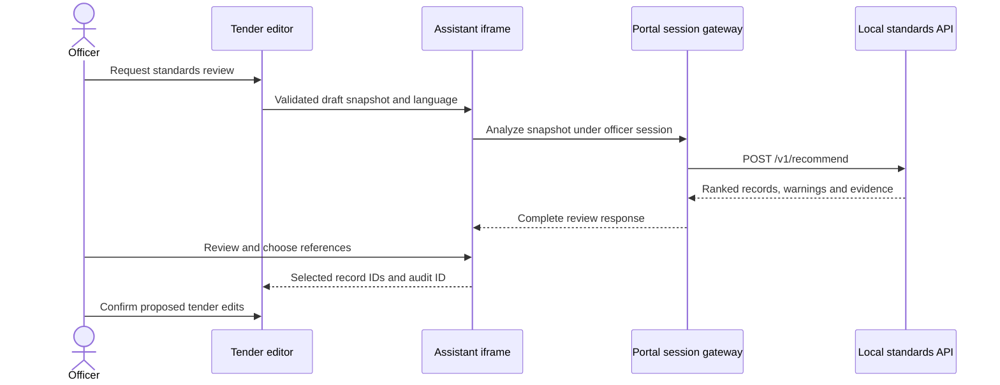
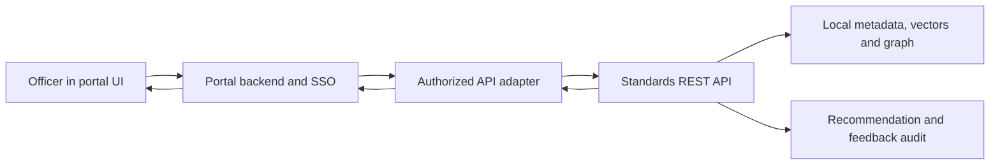

# Procurement portal integration plan

**Research checked: 21 September 2026.** This is a forward-looking design for portal teams. The working Phase 9 frontend connects to this project's local API only. **Actual GeM integration requires a formal API partnership/approval from GeM's technical team.** No GeM connector, credentials, approved sandbox access, bid submission, or production integration is claimed.

## What is publicly documented

| Source inspected | What the source supports | What it does not establish |
| --- | --- | --- |
| [GeM-hosted handbook](https://assets-bg.gem.gov.in/resources/pdf/GeM_handbook.pdf) | Its title page dates it to July 2018. It describes the platform and stakeholder framework. | It is not current developer documentation. Search-engine freshness must not be mistaken for the document's publication date. |
| [GeM–CPPP overview](https://eprocure.gov.in/cppp/sites/default/files/eproc/GemCPPP.pdf), dated 1 October 2023 | Describes pre-tender and post-tender integration using APIs. | No endpoint catalogue, authentication contract, sandbox onboarding, or permission for third-party tender-drafting extensions. |
| [NIC Government eProcurement System overview](https://www.nic.gov.in/project/government-eprocurement-system/) | Describes interoperability between CPPP, organizational systems and GeM. | Existing institutional interoperability is not evidence of unrestricted public API access. |
| [Ministry of Steel annual report 2025–26](https://steel.gov.in/sites/default/files/2026-04/Final%20Annual%20Report%202025-26%20%28English%20Version%29.pdf), page 104 | Mentions GeM–ERP integration for purchase-order and payment flows. | Does not publish a tender-recommendation extension API or grant this project access. |
| [NeGD Karnataka Public Procurement Portal profile](https://negd.gov.in/isl/Directory/statedata/389) | Describes REST/JSON services, a Spring Boot architecture and external integrations. | The page does not provide a public API specification or credentials/onboarding process. |
| [NIC Punjab presentation](https://cdnbbsr.s3waas.gov.in/s3f8bf09f5fceaea80e1f864a1b48938bf/uploads/2021/09/2025090185.pdf), page 49 | Describes API-based procurement-data integration in Punjab's State Public Procurement Portal. | It is a capability presentation, not a callable developer API contract. |
| [NIC Informatics, October 2024](https://informatics.nic.in/uploads/pdfs/6c4369e0_informatics_oct_2024.pdf), Odisha coverage | Illustrates GePNIC/WAMIS integration, including publishing and corrigendum interfaces. | Architecture labels do not establish public access to those interfaces. |
| [NIC Informatics, July 2026, Tripura](https://informatics.nic.in/files/websites/july-2026/tripura.php) | Lists two-way WAMIS/eProcurement integration in its development pipeline. | This proposed work must not be described as already deployed. |

**No public API documentation found as of 21 September 2026 that establishes an independently usable, authorized GeM tender-drafting integration contract.** The bounded searches of GeM/government sources, Karnataka and Punjab portal documentation also did not establish a public, self-service state e-tendering developer contract suitable for this use case. This is a finding about the inspected sources, not proof that private partner APIs do not exist. Some results were unrelated commercial products named “Gem” or third-party scraping services; neither is a valid GeM integration source.

GeM and CPPP robots.txt requests failed through the web tool; a direct check also failed. Access-policy details remain **unverified — confirm before relying on this**. No portal crawl, endpoint probing, login, or tender submission was performed. Public source observations and failed checks are recorded in [SOURCES.md](SOURCES.md). Recheck portal access terms and obtain the technical team's approved contract before implementation against its systems.

## Mode A: embeddable drafting assistant

The portal places a standards-assistant iframe beside its existing tender editor. A dedicated assistant origin hosts the reviewed frontend and a session-aware gateway. An iframe isolates styling and release cycles; a web component can alternatively package the UI for a portal that accepts the additional shared-page security and dependency responsibilities. Both are proposed deployment modes; Phase 9 does not ship a portal-ready widget or message bridge.

The proposed message envelope contains a protocol version, request ID, draft ID/version, language, operation and payload. Validate message shape, size, `event.origin` and `event.source`; send only to an exact configured target origin, never `*`. These are browser security requirements for this design, consistent with [MDN's postMessage guidance](https://developer.mozilla.org/en-US/docs/Web/API/Window/postMessage). Use an explicit allowed-parent policy and appropriately restricted iframe sandbox/CSP. Review cookie/SSO behavior for the chosen origins.

Do not put a durable API key in iframe URLs, client bundles, local storage or message payloads. The portal gateway should exchange an authenticated officer session for narrowly scoped access. That session exchange, role enforcement and tenant separation still need implementation. The Phase 9 loopback development proxy's temporary shared key is for local demonstration only.

Transfer only the draft portions the officer elects to analyze. Return selections as proposed edits with evidence, unresolved warnings and the exact draft version. If the editor has changed since the request, require re-review rather than inserting stale advice. Retain original-language input and normalized text. The widget never publishes a tender, removes warnings, silently updates an IS reference, or presents synthetic fixtures as official recommendations.

## Mode B: server-side REST integration

The portal's backend calls this service and renders the results in its own UI. The existing contract is [openapi.json](openapi.json): `POST /v1/recommend` accepts JSON text or a multipart PDF/DOCX. Related standards, details, category rules and feedback have separate `/v1` endpoints. These are **this project's endpoints**, not GeM or state-portal endpoints.

The adapter keeps service credentials server-side and preserves the full response: `recommendation_id`, original/normalized query, KB fingerprint, primary records and scores, allied relationship groups, version/amendment unknowns, hard warnings, dated certification rules and exact evidence. Render low-confidence results as review candidates. Never convert a null currentness field into “Latest Version” or an absent certification mapping into “not required.” Disable synthetic results for real portal deployments.

Bind each call to the portal's officer, draft and draft revision in the portal audit store. The current API authenticates keys and stores feedback actors; full SSO identity propagation, per-tenant authorization and production retention controls remain work for the integration phase. Officers' confirm/correct/reject actions call `POST /v1/feedback` with the recommendation ID and a permitted KB record ID. Corrections must not invent standards or silently alter the KB.

Queue long document work at the gateway and implement bounded concurrency, size limits, rate-limit handling and explicit cancellation semantics. Avoid blind retries after an ambiguous timeout: the current recommendation endpoint may already have committed an audit record and does not yet implement an idempotency-key contract. Add and test that contract before automated retries. Agree latency and availability targets after measuring the approved deployment hardware and corpus.

## Partnership and rollout

Provide the portal team with this design, OpenAPI contract, recorded local demo, metadata licensing boundaries and example evidence envelopes. Request the formal integration sponsor, approved architecture and security review process, current technical documentation, permitted data scope, authentication/SSO contract, sandbox access, change windows and support ownership. Do not infer any of these from public architecture slides.

Pilot with synthetic tender documents in an approved environment, then officer-reviewed cases. Acceptance should cover missing/ambiguous standards, stale mandatory-certification rules, multilingual meaning loss, obsolete versions, changed tender drafts, API outages and audit reconstruction. Run adversarial upload and authorization tests before broader exposure. Production use must be independently approved by the portal owner; this repository currently demonstrates a standalone local assistant.
